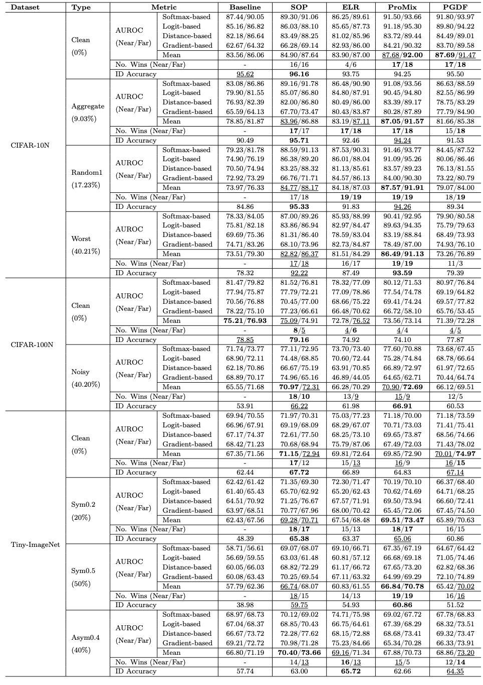

# Robust Out-Of-Distribution Detection Under Noisy Labels

This repository contains implementations and evaluations of various noise label learning(NLL) methods for handling noisy labels and out-of-distribution (OOD) detection. It integrates multiple state-of-the-art NLL approaches to provide a comprehensive framework for robust learning with noisy dataset.


## Repository Structure

### 📁 Core Modules

<div align="center">
  
  <p>Visualization of the core <b>Noisy Label Learning (NLL)</b> frameworks</p>
</div>

<details>
<summary><b>📖 Overview of NLL Methods</b></summary>
Each module addresses label noise through different mechanisms:

- **(a) SOP**: Instance-wise noise modeling via sparse over-parameterization
- **(b) ELR**: Early-learning regularization to prevent noise memorization  
- **(c) ProMix**: Progressive instance selection and debiased semi-supervised learning
- **(d) PGDF**: Prior-guided instance selection and denoising semi-supervised learning

Together, these architectures form the backbone of our proposed framework for **robust OOD detection under noisy labels**.
</details>


#### 1. **ELR (Early-Learning Regularization)** - `elr/`
- **ELR**: Implements Early Learning Regularization to prevent memorization of noisy labels without Mixup
- **ELR+**: Advanced version with enhanced regularization with Mixup
- **Papers**: S. Liu, J. Niles-Weed, N. Razavian, C. Fernandez-Granda, Early-learning regularization prevents memorization of noisy labels, in: Advances in Neural Information Processing Systems, volume 33, 2020, pp. 20331–20342.

#### 2. **SOP (Sparse Over-parameterization)** - `sop/`
- **SOP**: Robust training via sparse over-parameterization to separate label noise
- **Paper**: S. Liu, Z. Zhu, Q. Qu, C. You, Robust training under label noise by over-parameterization, in: Proceedings of the International Conference on Machine Learning, 2022, pp. 14153–14172.

#### 3. **PGDF (Prior Guided Denoising Framework)** - `pgdf/`
- **PGDF**: prior-guided instance selection and denoising semi-supervised learning
- **Paper**: W. Chen, C. Zhu, M. Li, Sample prior guided robust model learning to suppress noisy labels, in: Proceedings of the Joint European Conference on Machine Learning and Knowledge Discovery in Databases, 2023, pp. 3–19.

#### 4. **ProMix** - `promix/`
- **ProMix**: progressive instance selection and debiased semi-supervised learning
- **Paper**: R. Xiao, Y. Dong, H. Wang, L. Feng, R. Wu, G. Chen, J. Zhao, ProMix: Combating label noise via maximizing clean sample utility, in: Proceedings of the International Joint Conference on Artificial Intelligence, 2023, pp. 4442–4450.

#### 5. **OpenOOD** - `openood/`
- **OpenOOD**: Comprehensive benchmarking framework for generalized OOD detection
- **Paper**: J. Zhang, J. Yang, P. Wang, H. Wang, Y. Lin, H. Zhang, Y. Sun, X. Du, Y. Li, Z. Liu, Y. Chen, H. Li, OpenOOD v1.5: Enhanced benchmark for out-of-distribution detection, Data-Centric Machine Learning Research 2 (2024) 3.


## 🚀 Quick Start

### Installation

Each module has its own requirements. Please refer to individual module documentation for specific setup instructions, hyperparameters, and configurations.

**Original Repository Links:**
- **ELR**: https://github.com/shengliu66/ELR
- **SOP**: https://github.com/shengliu66/SOP
- **PGDF**: https://github.com/bupt-ai-cz/PGDF
- **ProMix**: https://github.com/Justherozen/ProMix


### Example Usage

#### Running ELR on CIFAR-10N with Aggregate noisy scenarios

```bash
cd elr/ELR
python train_cifar.py -c config_cifar10N_cosinewarming_seed0.json --seed 0 --beta 0.7 --lamb 3 --percent 9.0
```

#### Running SOP on CIFAR-10N with Aggregate noisy scenarios

```bash
cd sop
python train_cifar.py -c config_cifar10N.json --lr_u 10 --lr_v 10 --percent 9.0 --seed 0
```

#### Running PGDF on CIFAR-10N with Aggregate noisy scenarios

```bash
cd pgdf
# First, prior-guided instance selection 
python experiments/train_cifar_getPrior_cifar.py --preset c10.aggre
# Then, denoising semi-supervised learning
python experiments/train_cifar_prop1_energyO_mixupX.py --preset c10.aggre
```

#### Running ProMix on CIFAR-10N with Aggregate noisy scenarios

```bash
cd promix
python experiments/Train_cifar_prop1_energyO_mixupX.py \
    --noise_type aggre --cosine --dataset cifar10 --num_class 10 \
    --rho_range 0.5,0.5 --tau 0.99 --pretrain_ep 10 \
    --noise_mode cifarn --num_epochs 300 --seed 0
```

## 📊 Supported Datasets and OOD Detection Methods

### Datasets
- **CIFAR-N** - Real-world human annotated noisy labels from CIFAR-10/100
  - CIFAR-10N: Aggregate, Random1, Random2, Random3, Worst, Noisy
  - CIFAR-100N: Noisy, Random1, Random2, Random3, Worst
- **TinyImageNet** - Dataset with symmetric/asymmetric label noises
  - 64×64 images from 200 classes (200K images)

### Out-of-Distribution (OOD) Detection Methods

The repository supports 19+ post-hoc OOD detection methods:
`msp`, `odin`, `energy`, `temp_scaling`, `ebo`, `gradnorm`, `react`, `mls`, `klm`, `vim`, `knn`, `dice`, `rankfeat`, `ash`, `she`, `mds`, `rmds`, `gram`, `mds_ensemble`, `openmax`


## 📈 Performance

### Results on Noisy Label Datasets

Each method achieves state-of-the-art performance on various noisy label benchmarks:

<div align="center">
  
  <p><b>Performance comparison of NLL methods</b> on CIFAR-10N, CIFAR-100N and TinyImageNet with symmetric/asymmetric noises.</p>
</div>


## 📚 Publications

If you use this code in your research, please cite the relevant papers:

```bibtex
@inproceedings{ELR,
  title={Early-learning regularization prevents memorization of noisy labels},
  author={Liu, Sheng and Niles-Weed, Jonathan and Razavian, Narges and Fernandez-Granda, Carlos},
  booktitle={Advances in Neural Information Processing Systems},
  volume={33},
  pages={20331-20342},
  year={2020}
}

@inproceedings{SOP,
  title={Robust training under label noise by over-parameterization},
  author={Liu, Sheng and Zhu, Zhihui and Qu, Qing and You, Chong},
  booktitle={Proceedings of the International Conference on Machine Learning},
  pages={14153--14172},
  year={2022}
}

@inproceedings{PGDF,
  title={Sample prior guided robust model learning to suppress noisy labels},
  author={Chen, Wenkai and Zhu, Chuang and Li, Mengting},
  booktitle={Proceedings of the Joint European Conference on Machine Learning and Knowledge Discovery in Databases},
  pages={3--19},
  year={2023}
}

@inproceedings{Promix,
  title={Pro{M}ix: Combating label noise via maximizing clean sample utility},
  author={Xiao, Ruixuan and Dong, Yiwen and Wang, Haobo and Feng, Lei and Wu, Runze and Chen, Gang and Zhao, Junbo},
  booktitle={Proceedings of the International Joint Conference on Artificial Intelligence},
  pages={4442--4450},
  year={2023}
}

@article{openoodv1.5,
  title={Open{OOD} v1.5: Enhanced benchmark for out-of-distribution detection},
  author={Zhang, Jingyang and Yang, Jingkang and Wang, Pengyun and Wang, Haoqi and Lin, Yueqian and Zhang, Haoran and Sun, Yiyou and Du, Xuefeng and Li, Yixuan and Liu, Ziwei and Yiran Chen and Hai Li},
  journal={Data-Centric Machine Learning Research},
  volume={2},
  pages={3},
  year={2024}
}
```