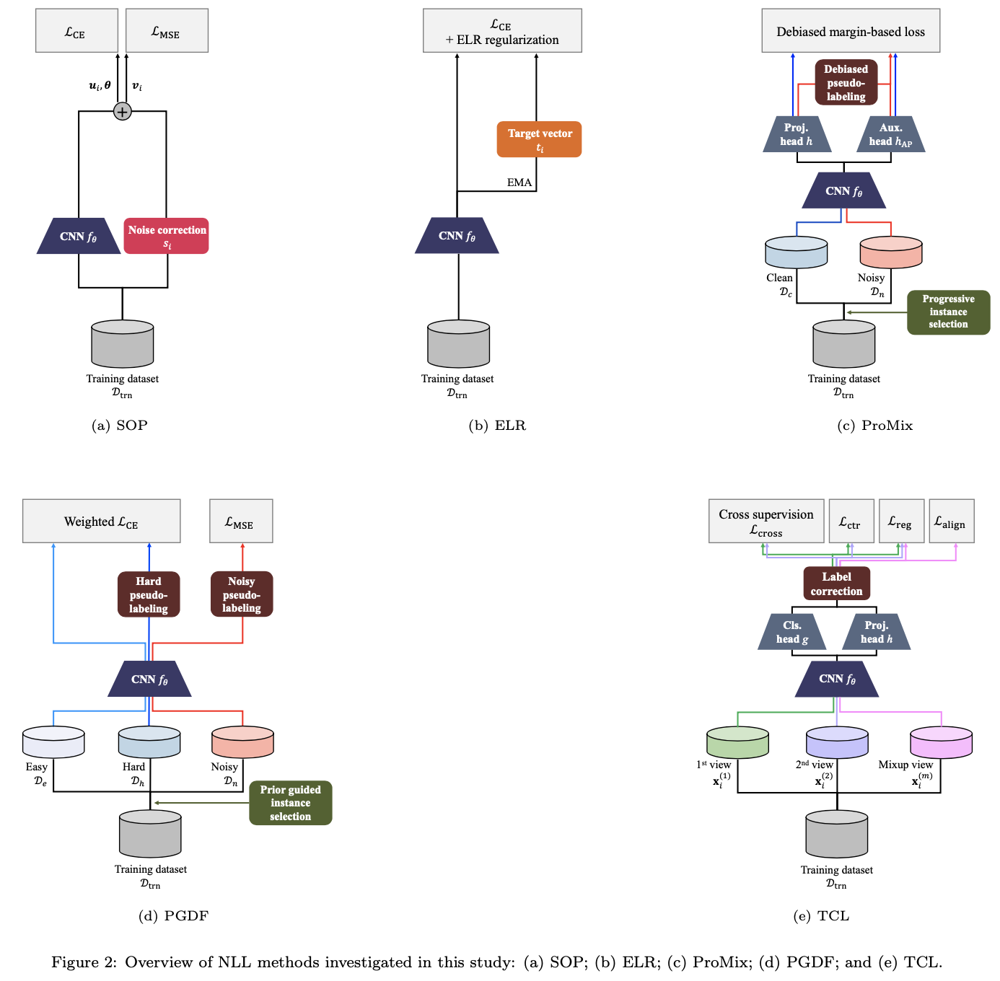
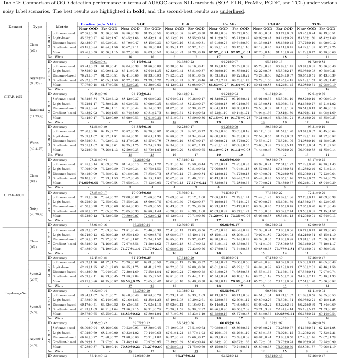

# Robust Out-Of-Distribution Detection Under Noisy Labels

This repository contains the implementation of our framework for robust out-of-distribution (OOD) detection under noisy labels. It integrates state-of-the-art noisy label learning (NLL) methods with post-hoc OOD detection methods and provides comprehensive evaluations on the OpenOOD benchmark across diverse noisy-label scenarios. The NLL methods in this repository are adapted from their original versions to improve OOD detection performance under noisy labels.

<div align="center">
  
</div>


## Repository Structure

### 📁 Core Modules

Each module addresses label noise through different mechanisms, together forming the backbone of our framework for **robust OOD detection under noisy labels**.

#### 1. **ELR (Early-Learning Regularization)** - `elr/`
- **ELR**: Implements Early Learning Regularization to prevent memorization of noisy labels without Mixup
- **ELR+**: Advanced version with enhanced regularization with Mixup
- **Paper**: S. Liu, J. Niles-Weed, N. Razavian, C. Fernandez-Granda, Early-learning regularization prevents memorization of noisy labels, in: Advances in Neural Information Processing Systems, volume 33, 2020, pp. 20331–20342.

#### 2. **SOP (Sparse Over-parameterization)** - `sop/`
- **SOP**: Robust training via sparse over-parameterization to separate label noise
- **Paper**: S. Liu, Z. Zhu, Q. Qu, C. You, Robust training under label noise by over-parameterization, in: Proceedings of the International Conference on Machine Learning, 2022, pp. 14153–14172.

#### 3. **PGDF (Prior Guided Denoising Framework)** - `pgdf/`
- **PGDF**: prior-guided instance selection and denoising semi-supervised learning
- **Paper**: W. Chen, C. Zhu, M. Li, Sample prior guided robust model learning to suppress noisy labels, in: Proceedings of the Joint European Conference on Machine Learning and Knowledge Discovery in Databases, 2023, pp. 3–19.

#### 4. **ProMix** - `promix/`
- **ProMix**: progressive instance selection and debiased semi-supervised learning
- **Paper**: R. Xiao, Y. Dong, H. Wang, L. Feng, R. Wu, G. Chen, J. Zhao, ProMix: Combating label noise via maximizing clean sample utility, in: Proceedings of the International Joint Conference on Artificial Intelligence, 2023, pp. 4442–4450.

#### 5. **TCL (Twin Contrastive Learning)** - `tcl/`
- **TCL**: Twin contrastive learning that models representations with a Gaussian mixture and detects wrongly labeled examples as out-of-distribution samples
- **Paper**: Z. Huang, J. Zhang, H. Shan, Twin contrastive learning with noisy labels, in: Proceedings of the IEEE/CVF Conference on Computer Vision and Pattern Recognition, 2023.

#### 6. **OpenOOD** - `openood/`
- **OpenOOD**: Comprehensive benchmarking framework for generalized OOD detection
- **Paper**: J. Zhang, J. Yang, P. Wang, H. Wang, Y. Lin, H. Zhang, Y. Sun, X. Du, Y. Li, Z. Liu, Y. Chen, H. Li, OpenOOD v1.5: Enhanced benchmark for out-of-distribution detection, Data-Centric Machine Learning Research 2 (2024) 3.


## 🚀 Quick Start

### Installation

Each module has its own `requirements.txt` (e.g. `pip install -r elr/requirements.txt`). All modules log to [Weights & Biases](https://wandb.ai); run `wandb login` once, or set `WANDB_MODE=offline` before training to disable cloud syncing.

**Original Repository Links:**
- **ELR**: https://github.com/shengliu66/ELR
- **SOP**: https://github.com/shengliu66/SOP
- **PGDF**: https://github.com/bupt-ai-cz/PGDF
- **ProMix**: https://github.com/Justherozen/ProMix
- **TCL**: https://github.com/Hzzone/TCL

Before running any of the examples below, set up the datasets as described in [Supported Datasets and OOD Detection Methods](#-supported-datasets-and-ood-detection-methods).

### Example Usage

#### Running ELR on CIFAR-10N with Aggregate noisy scenarios

```bash
cd elr/ELR
python train_cifar.py -c config_cifar10N_cosinewarming_seed0.json --seed 0 --beta 0.7 --lamb 3
```

#### Running SOP on CIFAR-10N with Aggregate noisy scenarios

```bash
cd sop
python train_cifar.py -c config_cifar10N.json --lr_u 10 --lr_v 10 --percent 9.0 --seed 0
```

#### Running PGDF on CIFAR-10N with Aggregate noisy scenarios

```bash
cd pgdf
python experiments/train_cifar_getPrior_cifar.py --preset c10.aggre
python experiments/train_cifar_prop1_energyO_mixupX.py --preset c10.aggre
```

#### Running ProMix on CIFAR-10N with Aggregate noisy scenarios

```bash
cd promix
python experiments/Train_cifar_prop1_energyO_mixupX.py \
    --noise_type aggre --cosine --dataset cifar10 --num_class 10 \
    --rho_range 0.5,0.5 --tau 0.99 --pretrain_ep 10 \
    --noise_mode cifarn --num_epochs 300 --seed 0
```

#### Running TCL on CIFAR-10N with Aggregate noisy scenarios

```bash
cd tcl
python main.py models/tcl/configs/seed0/cifar10n_aggre_r18.yml
```

## 📊 Supported Datasets and OOD Detection Methods

### Datasets
- **CIFAR-N** - Real-world human annotated noisy labels from CIFAR-10/100
  - CIFAR-10N: Clean, Aggregate, Random1, Worst
  - CIFAR-100N: Clean, Noisy
  - The human-annotated noisy labels are from the official [CIFAR-10N/100N repository](https://github.com/UCSC-REAL/cifar-10-100n), with per-scenario labels (`CIFAR-10_human.pt`, `CIFAR-100_human.pt`) placed together with the CIFAR-10/100 data under `CIFAR-10N_100N/` at the repository root:


- **Tiny-ImageNet** - Dataset with generated symmetric/asymmetric label noises
  - Dataset construction:
    - The downloaded Tiny-ImageNet comes with class labels.
    - Images are regrouped into per-class folders based on these labels.
    - Following OpenOOD's split convention, the original train set is used for training, while the original validation set is further split into new validation and test sets.
    - For each split, an imglist file listing each image's path and class label is generated (e.g., `openood/data/benchmark_imglist/tinyimagenet/train_tin.txt`).
    - The constructed dataset is available for download [here](https://drive.google.com/file/d/1ARhAprwbTBxa5sxEFnfuzuVsZ2mMeA9W/view?usp=sharing).

  - Symmetric and asymmetric label noises are synthetically injected into the clean training labels following the noise generation protocol of Tanaka et al. (D. Tanaka, D. Ikami, T. Yamasaki, K. Aizawa, Joint optimization framework for learning with noisy labels, in: Proceedings of the IEEE Conference on Computer Vision and Pattern Recognition, 2018, pp. 5552–5560). Example noisy imglist files: `openood/data/benchmark_imglist/tinyimagenet/train_tin_asym_0.4.txt`, `openood/data/benchmark_imglist/tinyimagenet/train_tin_sym_0.2.txt`, `openood/data/benchmark_imglist/tinyimagenet/train_tin_sym_0.5.txt`.


- Setup: alternatively, download the full OpenOOD v1.5 benchmark datasets into `openood/data`. This also installs the OOD datasets (e.g., iNaturalist, NINCO, OpenImage-O, SSB-hard, Textures) used for OOD evaluation:
    ```bash
    cd openood
    sh scripts/download/download.sh
    ```
    For Tiny-ImageNet, the corresponding imglist files are already provided in this repository under `openood/data/benchmark_imglist/tinyimagenet`, so you can use them directly without additional generation.


### Out-of-Distribution (OOD) Detection Methods

The repository supports 19 post-hoc OOD detection methods:
`msp`, `odin`, `energy`, `temp_scaling`, `ebo`, `gradnorm`, `react`, `mls`, `klm`, `vim`, `knn`, `dice`, `rankfeat`, `ash`, `she`, `mds`, `rmds`, `gram`, `mds_ensemble`, `openmax`


## 📈 Performance

### Results on Noisy Label Datasets

Each method achieves state-of-the-art performance on various noisy label benchmarks:

<div align="center">
  
</div>


## 📚 Publications

If you use this code in your research, please cite the relevant papers:

```bibtex
@inproceedings{ELR,
  title={Early-learning regularization prevents memorization of noisy labels},
  author={Liu, Sheng and Niles-Weed, Jonathan and Razavian, Narges and Fernandez-Granda, Carlos},
  booktitle={Advances in Neural Information Processing Systems},
  volume={33},
  pages={20331-20342},
  year={2020}
}

@inproceedings{SOP,
  title={Robust training under label noise by over-parameterization},
  author={Liu, Sheng and Zhu, Zhihui and Qu, Qing and You, Chong},
  booktitle={Proceedings of the International Conference on Machine Learning},
  pages={14153--14172},
  year={2022}
}

@inproceedings{PGDF,
  title={Sample prior guided robust model learning to suppress noisy labels},
  author={Chen, Wenkai and Zhu, Chuang and Li, Mengting},
  booktitle={Proceedings of the Joint European Conference on Machine Learning and Knowledge Discovery in Databases},
  pages={3--19},
  year={2023}
}

@inproceedings{Promix,
  title={Pro{M}ix: Combating label noise via maximizing clean sample utility},
  author={Xiao, Ruixuan and Dong, Yiwen and Wang, Haobo and Feng, Lei and Wu, Runze and Chen, Gang and Zhao, Junbo},
  booktitle={Proceedings of the International Joint Conference on Artificial Intelligence},
  pages={4442--4450},
  year={2023}
}

@inproceedings{TCL,
  title={Twin contrastive learning with noisy labels},
  author={Huang, Zhizhong and Zhang, Junping and Shan, Hongming},
  booktitle={Proceedings of the IEEE/CVF Conference on Computer Vision and Pattern Recognition},
  pages={11661--11670},
  year={2023}
}

@inproceedings{Tanaka2018,
  title={Joint optimization framework for learning with noisy labels},
  author={Tanaka, Daiki and Ikami, Daiki and Yamasaki, Toshihiko and Aizawa, Kiyoharu},
  booktitle={Proceedings of the IEEE Conference on Computer Vision and Pattern Recognition},
  pages={5552--5560},
  year={2018}
}

@article{openoodv1.5,
  title={Open{OOD} v1.5: Enhanced benchmark for out-of-distribution detection},
  author={Zhang, Jingyang and Yang, Jingkang and Wang, Pengyun and Wang, Haoqi and Lin, Yueqian and Zhang, Haoran and Sun, Yiyou and Du, Xuefeng and Li, Yixuan and Liu, Ziwei and Yiran Chen and Hai Li},
  journal={Data-Centric Machine Learning Research},
  volume={2},
  pages={3},
  year={2024}
}
```